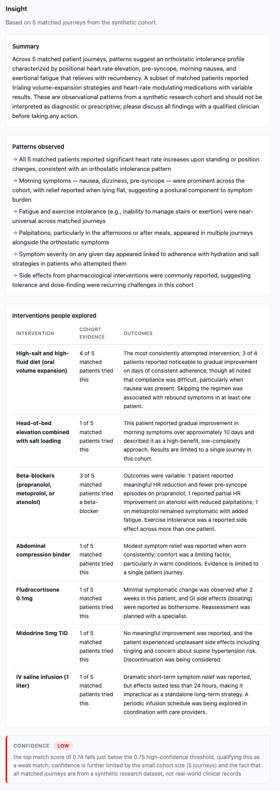
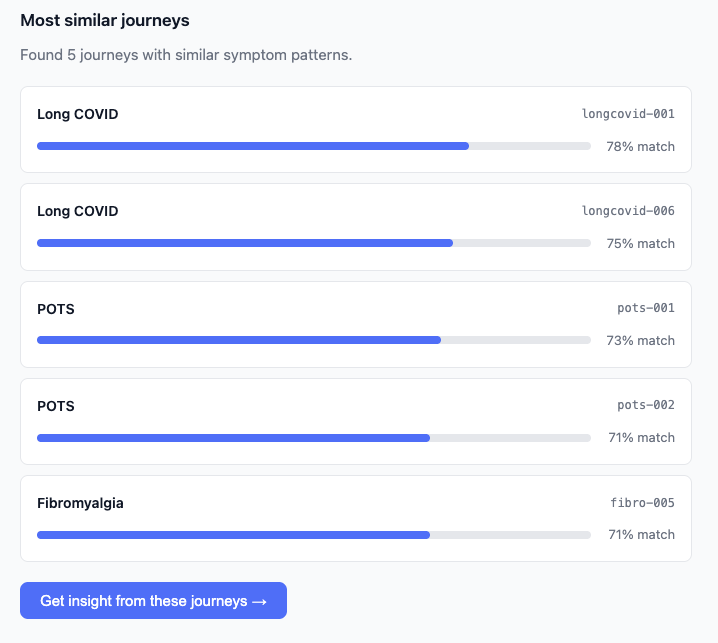

# CrossJourney Pattern Matcher

> **Synthetic data only. Not medical advice. Prototype.**

A demo built for an interview with Atlas (theatlasnetwork.ai) — a startup building a
personal health agent that aggregates self-reported symptom data to surface cross-patient
patterns.

---

## Why a matching layer, not a chatbot

When I read Atlas's thesis, the thing that stood out wasn't the AI assistant angle — it was
the *aggregation* angle. The value Atlas is building isn't a smarter symptom-checker; it's
the ability to ask "what did people with a similar pattern actually try, and how did it go?"
That question only becomes answerable once you have enough journeys to pattern-match across.

A chatbot trained on general medical knowledge already exists. What doesn't exist — and what
Atlas is uniquely positioned to build — is a system where a patient's timeline becomes a
query against a growing corpus of real self-reported journeys. The insight comes from the
cohort, not from the model's priors.

So I built the matching layer: embed symptom-only signatures, cosine-sim at query time,
pass the top-K matched journeys to Claude to synthesize what those people tried. The LLM's
job is synthesis and framing, not knowledge retrieval. The knowledge comes from the data.

---

## How it works

```
User enters symptom timeline
        │
        ▼
Build symptom-only signature
        │
        ▼
Embed with Voyage voyage-3
        │
        ▼
Cosine-sim against 42-journey matrix (numpy, in RAM)
        │
        ▼
Top-5 matched journeys retrieved
        │
        ▼
Claude synthesizes interventions + patterns from those journeys
        │
        ▼
Insight card: summary · patterns · interventions with cohort evidence · confidence
```

Matching is on **symptoms only** — interventions are hidden during retrieval, then revealed
in the insight step. This mirrors the decentralized-study design: find people like you
first, then see what they explored.

---

## Walkthrough

**1. Insights — patterns, interventions, and confidence from the matched cohort**



**2. Landing page — pick a preset or describe your own symptoms**


**3. Journey similarity — top-5 matched journeys with cosine similarity scores**



---

## Running locally

**Prerequisites:** Python 3.9+, Node 18+, `ANTHROPIC_API_KEY`, `VOYAGE_API_KEY`.

```bash
# 1. Generate the synthetic cohort (one-time)
pip install anthropic python-dotenv
python generate_cohort.py

# 2. Backend
cd backend
pip install -r requirements.txt
uvicorn main:app --reload
# → http://localhost:8000

# 3. Frontend (new terminal)
cd frontend
npm install
npm run dev
# → http://localhost:5173
```

---

## Deploying

### Backend → Render

1. Connect repo to [render.com](https://render.com), select **New Web Service**.
2. Render auto-detects `render.yaml` — sets `rootDir: backend` and runs
   `uvicorn main:app --host 0.0.0.0 --port $PORT`.
3. Add env vars in the Render dashboard:
   - `ANTHROPIC_API_KEY`
   - `VOYAGE_API_KEY`
   - `ALLOWED_ORIGINS` → your Vercel frontend URL (e.g. `https://crossjourney.vercel.app`)

`cohort.json` is committed to the repo, so Render has it at deploy — no generation step
needed at runtime.

### Frontend → Vercel

1. Import repo into [vercel.com](https://vercel.com), set **Root Directory** to `frontend/`.
2. Vercel auto-detects Vite. Build command: `npm run build`. Output dir: `dist`.
3. Add env var:
   - `VITE_API_URL` → your Render backend URL (e.g. `https://crossjourney-backend.onrender.com`)

---

## Production trade-offs deliberately skipped

This is an afternoon prototype. Each of these would be the next real step:

| Skipped | Production replacement | Why it matters |
|---|---|---|
| numpy cosine-sim in RAM | pgvector on Postgres | Scales beyond a few thousand journeys; persistent across restarts |
| Synthetic cohort (42 journeys) | Real patient journey ingestion | Actual aggregation value requires real self-reported data |
| No auth | Auth + per-user journey storage | Patients need to own their data; contributes to the shared pool |
| Single Claude call for insight | Retrieval-augmented pipeline with caching | Latency and cost at scale |
| Frontend-only confidence label | Calibrated uncertainty model | Weak-match warnings need ground truth to validate |
| No clinician-facing view | Separate clinician dashboard | Atlas's B2B angle; different output format and access controls |

---

## Disclaimer

All patient journeys in this demo are **entirely synthetic** — generated by Claude and
tagged `synthetic: true`. No real patient data was used at any stage. This tool is a
prototype for demonstration purposes only.

**This is not medical advice.** The patterns and interventions surfaced are hypothesis
generators, not clinical recommendations. Always discuss health decisions with a qualified
clinician.
